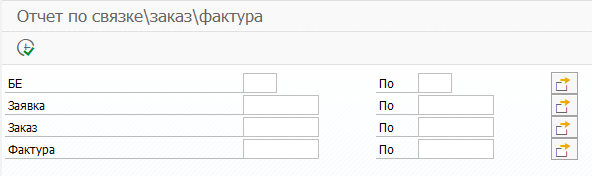
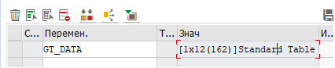
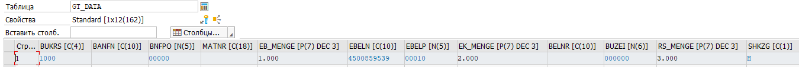
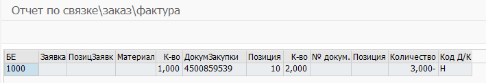

# request-order-invoice-sap-report
Тестовое задание по SAP ERP.

Возможен ввод без данных из селекционного экрана.

Так как тестовых данных нет, а по запросу без уточнений искать долго, то ввел их через отладчик.

Вывод данных. Двойное нажатие по ячейкам заявкам, заказа, фактуры возможно, происходит переход в определенные транзакции.

